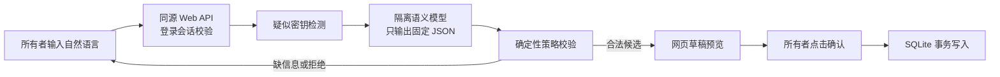

# API Hub 输入渠道与 Web 智能录入

## 已确认的产品边界

API Hub 只接收文本，不保存语音，也不实现 TTS。

| 客户端 | 用户输入 | API Hub 接收内容 |
|---|---|---|
| Web | 网页文本框、手动表单 | 文本或结构化表单 |
| OpenClaw | 其聊天渠道最终提供的消息 | OpenClaw 提交的文本 |
| 未来 Android App | 手动输入、Android 系统语音输入、搜狗等输入法语音转文字 | 转写后的文本 |

Web 不提供麦克风按钮或音频上传接口。如果手机输入法能向浏览器文本框进行语音输入，那只是系统键盘行为，不属于 API Hub 的语音能力。

OpenClaw 所连接的飞书等渠道能否接收、下载或转写语音，由 OpenClaw 和渠道自身配置决定。API Hub 不接管这部分音频流程，也不依赖它一定可用。

## Web 智能录入流程



网页文本和 OpenClaw 文本共用同一个语义模型、JSON Schema、确定性策略和 SQLite 数据库。区别仅在身份认证与确认方式：

- Web 使用 HttpOnly、SameSite=Strict 的所有者会话 Cookie，草稿由网页按钮确认。
- OpenClaw 使用独立 Bearer Token、可选 HMAC 和一次性六位确认码。
- 两者都不能让模型直接写数据库。

## 登录和内部调用

浏览器只访问同源 `/api/session` 和 `/api/web/*`。Web 服务校验登录会话后，通过 Docker 私有网络调用 Gateway，并注入只存在于服务端的 `APIHUB_WEB_INTERNAL_TOKEN`。

生产环境必须配置：

```text
APIHUB_WEB_PASSWORD=<owner-password>
APIHUB_WEB_SESSION_SECRET=<high-entropy-random-secret>
APIHUB_WEB_INTERNAL_TOKEN=<different-high-entropy-random-token>
```

会话默认有效 12 小时。登录接口按来源地址限制 15 分钟内最多 10 次失败尝试。生产 Cookie 带 `Secure`，因此公网入口必须使用 HTTPS。Gateway 的 8787 端口仍只绑定 VPS 回环地址，不直接暴露给浏览器。

## Web Gateway API

这些路径只允许 Web 服务使用内部 Token 调用，不是公共浏览器 API：

```text
GET    /v1/web/state
POST   /v1/web/intake
POST   /v1/web/drafts/:id/commit
POST   /v1/web/drafts/:id/cancel
POST   /v1/web/subscriptions
PUT    /v1/web/subscriptions/:id
DELETE /v1/web/subscriptions/:id
PUT    /v1/web/tags
POST   /v1/web/import
```

`/v1/web/intake` 只保存来源、状态和消息 SHA-256，不保存自然语言原文。疑似凭据在模型调用前被拒绝。

## 数据迁移

Web 首次登录后读取 Gateway SQLite。如果服务端没有订阅，并且当前浏览器存在旧版 `localStorage` 数据，Web 会尝试一次安全迁移。迁移成功后写入标记；旧浏览器副本不会立即删除，仍可作为临时恢复来源。

从此以后，订阅、标签和审计记录以 Gateway SQLite 为唯一权威数据源。浏览器存储不再承担订阅数据持久化。

## Android 后续实现

- 普通文本框天然支持系统输入法，包括搜狗输入法的语音转文字。
- 如果需要 App 自己的麦克风按钮，再通过原生桥接调用 Android `SpeechRecognizer`。
- Android 最终只向 API Hub 提交文字，继续使用相同的语义闸机和确认流程。
- 不在 VPS 上部署 Whisper 或其他本地语音模型。
