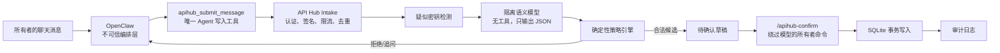

# OpenClaw × API Hub 双闸机架构

状态：第一版安全基础已落地。本文是架构决策记录，也是后续实现与审计的基准。

## 目标

允许用户通过 OpenClaw 所连接的聊天渠道管理 API 订阅资料，同时保证：

- OpenClaw 和它加载的其他 Skill 不能直接写 API Hub 数据库。
- OpenClaw 只能提交一条原始业务消息，不能选择 SQL、文件或内部写接口。
- 独立大模型只负责语义解析，不拥有工具、网络、文件系统或数据库权限。
- 普通程序负责身份验证、字段白名单、查重、风控和正式写入。
- 每项写操作必须形成有期限的一次性草稿，并由所有者确定性确认。
- 永久删除、标签管理、凭据管理和系统设置永不开放给聊天 Agent。
- API Hub 的订阅记录仍然不接收任何 API Key、Token 或 Secret；语义闸机的模型 BYOK Key 只能从所有者设置页进入独立加密仓库。

## 信任边界



OpenClaw 被视为方便但可能误操作的编排层，不属于最终安全边界。API Hub Gateway 是唯一允许写入服务端订阅数据库的入口。

## 双闸机

### 第一闸：语义模型

模型把自然语言转换为固定 JSON，支持的意图只有：

- `create_subscription`
- `update_subscription`
- `update_invoice`
- `archive_subscription`
- `query_subscriptions`
- `unknown`

模型不能执行动作。它不知道数据库密码、OpenClaw Token、模型 API Key 或服务器文件路径。

### 第二闸：确定性策略引擎

策略代码重新检查模型结果：

- 置信度达到阈值，默认 `0.85`。
- 必填字段完整。
- 价格、日期、币种、周期与提醒天数合法。
- 标签必须出现在 Gateway SQLite 的当前标签目录中；网页重命名标签后立即生效。
- 发票链接只能使用 HTTPS。
- 修改目标必须唯一匹配已有订阅。
- 新增时不能与现有活动订阅同名。
- 字段名或消息内容不能包含凭据特征。
- 删除、标签管理、凭据管理和设置操作一律拒绝。

只有同时通过两道闸机才生成草稿，仍不会直接写入。

## 确认流程

每个草稿获得：

- UUID 草稿 ID
- 六位一次性确认码
- 默认 15 分钟有效期
- 人类可读字段差异
- 状态 `pending_confirmation`

确认命令示例：

```text
/apihub-confirm 41ec... 583104
```

该命令由 OpenClaw 插件的 `registerCommand` 处理，命令型消息直接绕过模型。插件还要求发送者是 OpenClaw 所有者。确认码只保存 SHA-256 派生值，提交成功后草稿状态变成 `committed`，不能重复使用。

取消命令：

```text
/apihub-cancel 41ec...
```

## 失败模式

| 故障 | API Hub 行为 |
|---|---|
| OpenClaw 重复调用 | 依据 `sourceMessageId` 幂等返回，不创建第二个草稿 |
| OpenClaw 选错意图 | API Hub 模型重新判断，策略引擎再次验证 |
| 模型不可用 | 标记 `parse_failed`，不写订阅数据 |
| 模型低置信度 | 返回 `needs_clarification` |
| 消息疑似含密钥 | 在模型调用前拒绝；只保存消息哈希，不保存原文 |
| 目标不存在或重名 | 不生成可提交草稿 |
| 确认码错误 | HTTP 403，不写入 |
| 草稿过期 | HTTP 410，不写入 |
| 重复确认 | HTTP 409，不重复写入 |
| 数据库写入失败 | SQLite 事务回滚 |
| OpenClaw 完全不可用 | Web 应用仍可独立运行 |

## 数据保留

Gateway 数据库包含：

- `subscriptions`
- `tag_definitions`
- `agent_inbox`
- `ingestion_drafts`
- `audit_logs`

`agent_inbox` 只保存消息 SHA-256、来源消息 ID、发送者和状态，不保存聊天原文。审计日志保存结构化的写入前后差异，不保存认证头或模型 API Key。

## 当前阶段

Web UI 与 OpenClaw 已使用同一 Gateway SQLite。Web 通过独立的单用户登录会话和 Docker 私有内部 Token 访问；OpenClaw 继续使用自己的 Token、HMAC 与一次性确认码。两条入口互不共享认证凭据。

## 官方安全依据

- OpenClaw 安全指南指出，系统提示词属于软约束，强制边界应由工具策略、审批、沙箱和渠道白名单提供：<https://docs.openclaw.ai/gateway/security>
- 插件工具可由 `api.registerTool` 注册并设为可选工具：<https://docs.openclaw.ai/plugins/building-plugins>
- 插件命令可绕过模型直接执行，且命令发送者可受授权与所有者身份约束：<https://docs.openclaw.ai/slash-commands>
- 插件审批在无审批路由、超时或异常决定时失败关闭：<https://docs.openclaw.ai/plugins/plugin-permission-requests>
